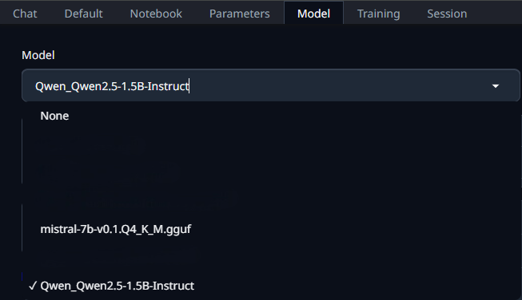

# Generador de historias con API local usando text-generation-webui

1. Selección de modelos

   Comenzamos eligiendo los modelos, vamos a utilizar los siguientes:

   * AIDC-AI/Marco-o1
   * nvidia/Hymba-1.5B-Instruct
   * Qwen/Qwen2.5-1.5B-Instruct

  

2. Accedemos mediante la terminal al directorio del repositorio, donde crearemos un entorno virtual de python.

   
   

