# Generador de historias con API local usando text-generation-webui

1. Selección de modelos

   Comenzamos eligiendo los modelos, vamos a utilizar los siguientes:

   * Qwen/Qwen2.5-1.5B-Instruct
   * TheBloke/Mistral-7B-v0.1-GGUF
   
   

2. Pasamos a text-generation-webui, donde haremos una primera prueba de los modelos.
   
   Pedimos una historia donde el personaje principal es un profesor, el secundario un alumno, tiene lugar en una piscina y la acción es comer.

   El primer modelo lo solicitamos con más tokens que el segundo. Recibiendo las siguientes respuestas, respectivamente:

   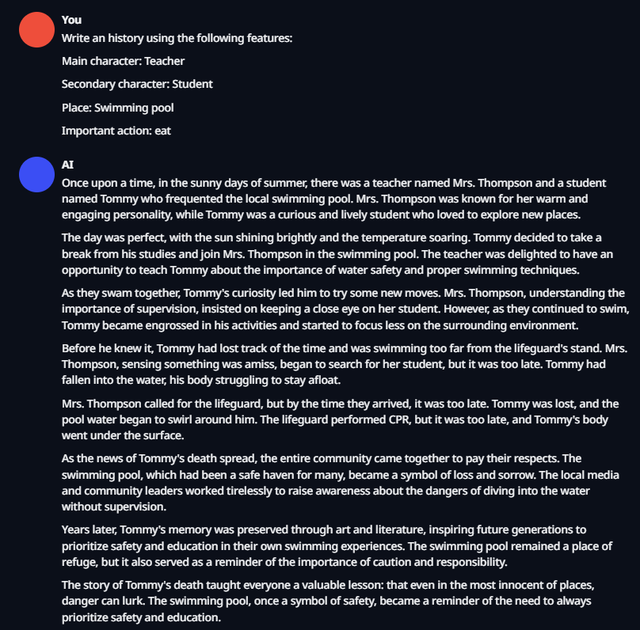

   ---

   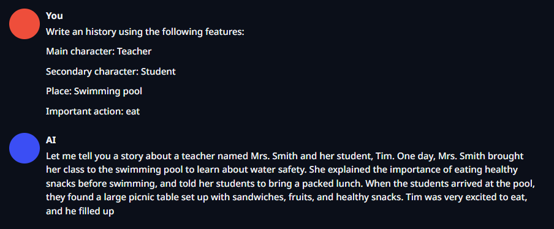

3. Accedemos mediante la terminal al directorio del repositorio, donde crearemos un entorno virtual de python.

   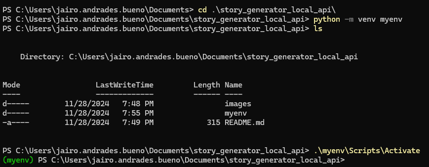

4. Continuamos en la terminal para ejecutar el programa usando el modelo Qwen en la CPU.

   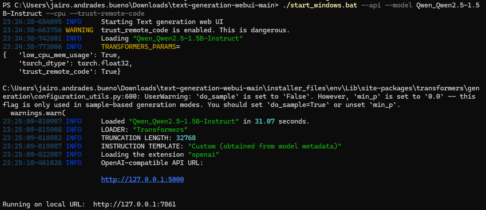
   
   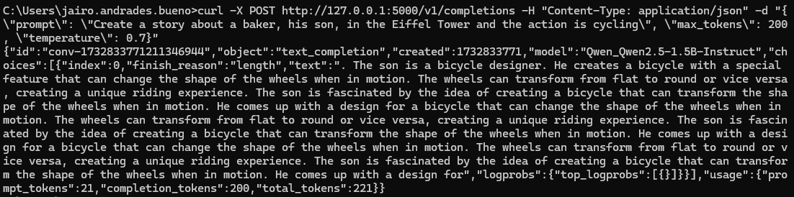
   
5. Pasamos a desarrollar el programa que pida los datos, ejecute el modelo mediante la api anteriormente creada y muestre la historia 

   Los datos que pedirá serán:

      > Personaje principal
      
      > Personaje secundario
      
      > Escenario/Lugar
      
      > Acción que debe acontecer

   Adicionalmente, también se preguntará por el nivel de creatividad que se busca: bajo, medio o alto.

   El código se encuentra en el archivo [story_generator.py](story_generator.py).

   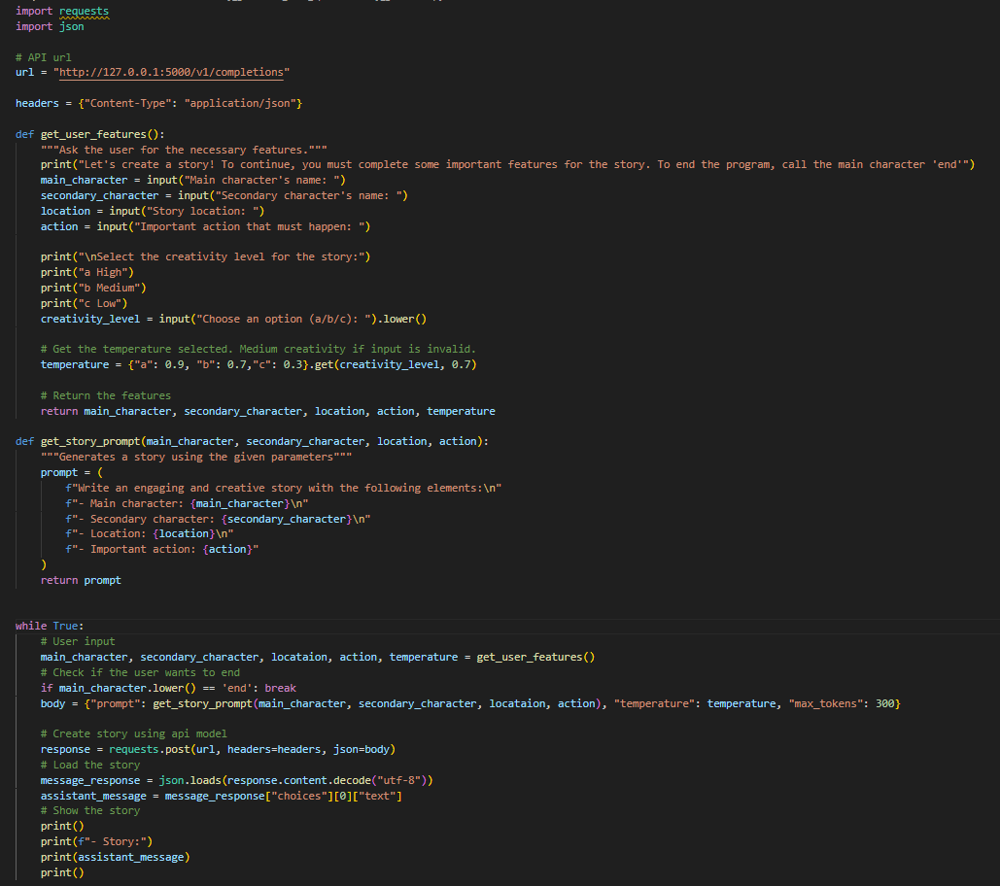

7. Ejecutamos el código para ver la respuesta de la api con el modelo Qwen, mostrando un ejemplo por nivel de creatividad.

   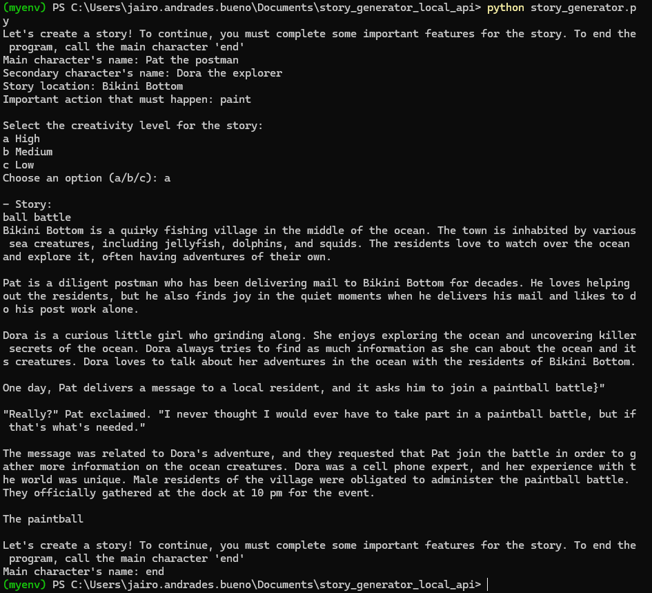

   ---
   
   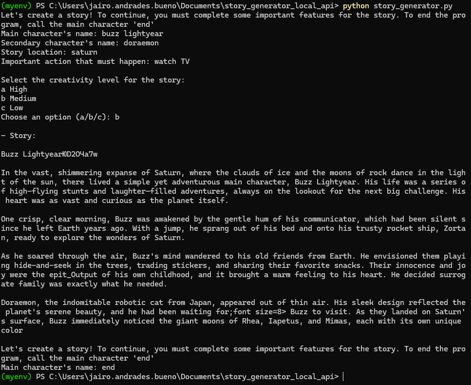

   ---

   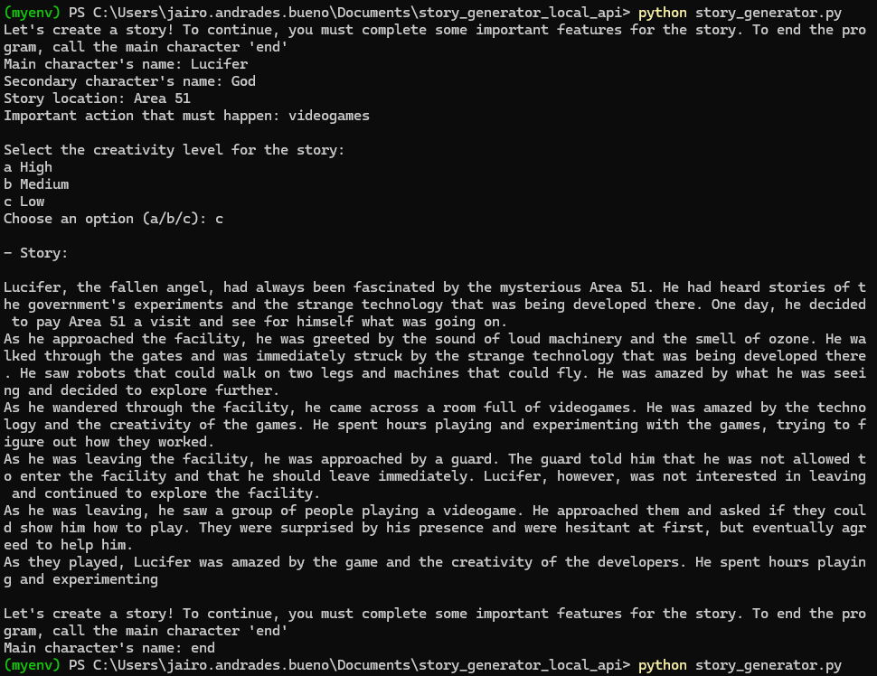

9. Cerramos la api del modelo Qwen y abrimos la del modelo Mistral
   
   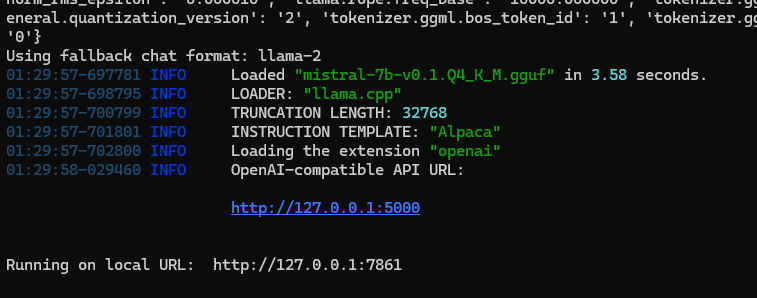

   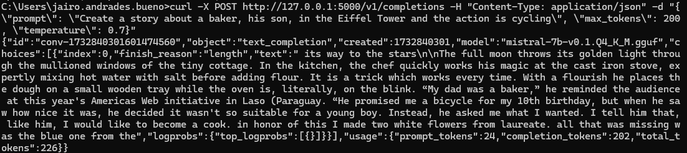

10. Ejecutamos de nuevo el código de la misma manera, pero esta vez la url hará referencia al modelo Mistral.

   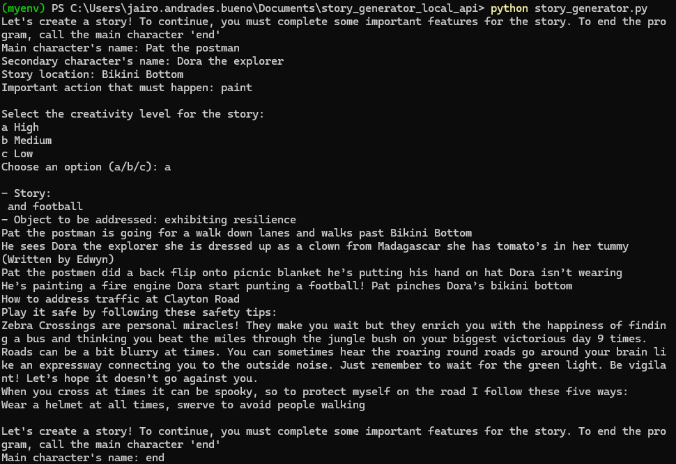

   ---
   
   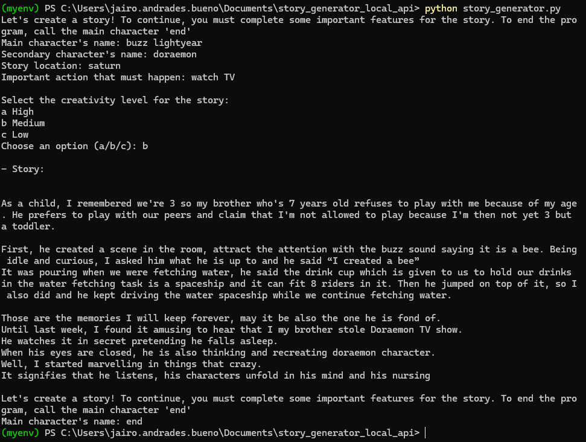

   ---

   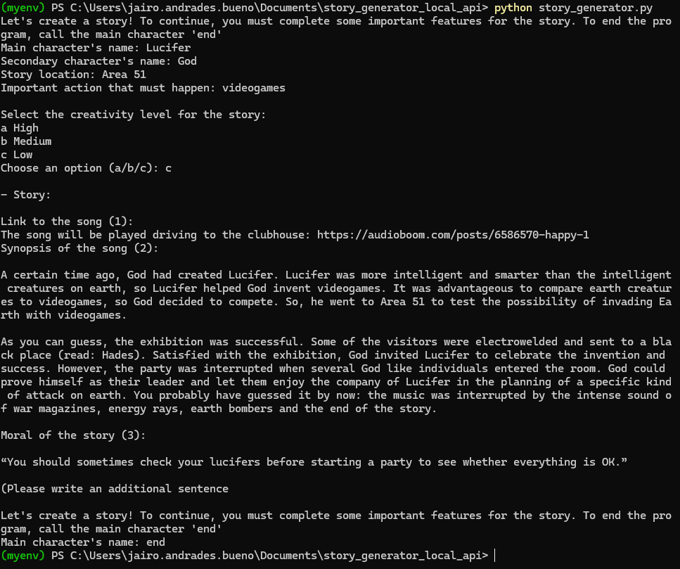
   
